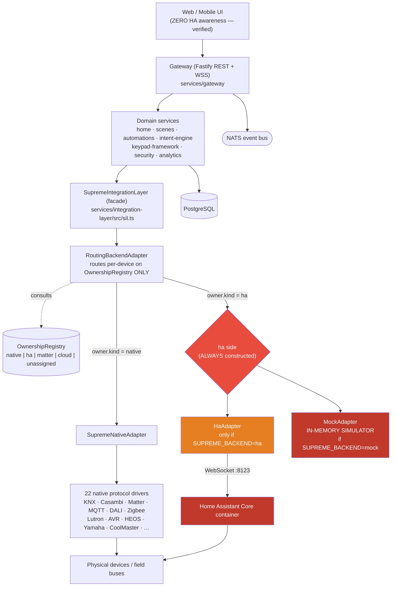
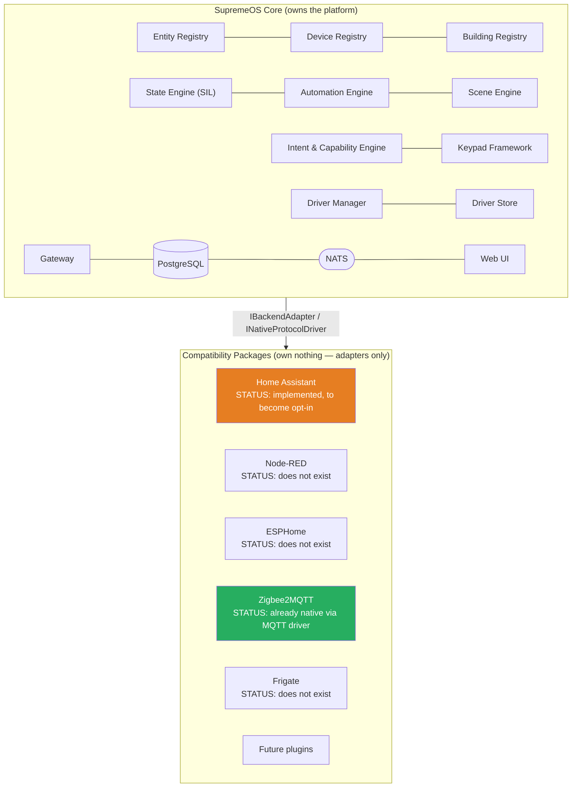

# SupremeOS — Home Assistant Dependency Audit & Native Core Migration Roadmap

> **Analysis only.** No application code was modified, no Home Assistant code was removed,
> no protocol driver was redesigned. Every claim below cites the file/line it was verified
> from. Anything that could not be verified from the repository is explicitly marked
> **NOT VERIFIED** rather than guessed.
>
> Audit date: 2026-08-03 · Repo state: `claude/universal-keypad-framework-7khr2o` @ `3365d46`
> (Phase 2 Universal Intent & Capability Engine merged).

---

## Executive summary (read this first)

The headline finding is better than the brief assumes, with one specific caveat that
matters more than everything else combined.

**Home Assistant is already almost entirely out of the runtime path.** All HA-specific
code is confined to exactly **four files** in one directory
(`services/integration-layer/src/ha/`), with exactly **two** consumers anywhere else in
the repository — one of which is **dead code that is never called at runtime**. Every
protocol driver is 100% native. The entire UI has zero HA calls. Every registry
(device, entity identity, room/floor/area, state, capabilities) is Supreme-owned.
Automations, scenes, energy history and statistics all execute natively.

**SupremeOS already boots and runs with no Home Assistant process at all** — this is not
theoretical; the entire 240-test gateway suite, including full end-to-end device control,
runs with `SUPREME_BACKEND` unset (→ `"mock"`), which never constructs an HA adapter,
never opens an HA socket, and never reads an HA token
(`services/gateway/src/bootstrap.ts:146-152`, `config.ts:194`).

**The caveat — and the single most important finding in this audit:** there is currently
**no "native-only" backend mode**. `RoutingBackendAdapter` is always constructed with an
`ha` side (`bootstrap.ts:288-294`), and that side is either the real `HaAdapter` **or
`MockAdapter` — an in-memory simulator** (`mock-adapter.ts:15-17`, "In-memory backend
adapter for Phase-0 verification and tests"). Any device whose ownership is recorded as
`"ha"` is therefore served, on an HA-less hub, by a **simulator that fabricates state** —
not by real hardware, and not by an honest error. Turning HA off today does not remove
the dependency; it silently replaces it with a fake. **This, not the HA code itself, is
the real blocker**, and it is Critical.

Estimated remaining work to make HA genuinely optional: **1 Critical blocker, 2 High, 3
Medium, 2 Low** — detailed in Phase 10. The Critical and both High items are small,
well-scoped changes (a third adapter mode, a compose flag, and a dead-code decision), not
a platform rewrite.

---

## Phase 1 — Dependency Discovery

### 1.1 Complete inventory of HA-referencing files

Repository-wide search (`homeassistant|home_assistant|hass|HaAdapter|8123|entity_id|
call_service`, excluding `node_modules`/`dist`) yields the following **complete** list.

**Runtime code (4 files — the entire HA surface):**

| File | Lines | What it is | Required? |
|---|---|---|---|
| `services/integration-layer/src/ha/ha-adapter.ts` | 189 | `HaAdapter implements IBackendAdapter` — command/state/discovery translation | Only when `backend=ha` |
| `services/integration-layer/src/ha/ha-ws-transport.ts` | 161 | HA WebSocket protocol (auth handshake, id-correlated frames, event subscription) | Only when `backend=ha` |
| `services/integration-layer/src/ha/ha-provisioner.ts` | 204 | Headless HA onboarding + long-lived token minting | Only when `backend=ha` **and** no token cached |
| `services/integration-layer/src/ha/capability-mapper.ts` | ~200 | Supreme capability ↔ HA service/state translation | Only when `backend=ha` |

**Consumers outside `ha/` (exactly two):**

| File | Line | Call | Conditional? |
|---|---|---|---|
| `services/gateway/src/bootstrap.ts` | 146-152 | `new HaWsTransport(...)` → `new HaAdapter(...)` | **Yes** — `if (config.backend === "ha")` |
| `services/gateway/src/bootstrap.ts` | 69-78 | `provisionHaToken(...)` | **Yes** — inside `resolveHaToken`, only reached when `backend=ha` |
| `services/automations/src/compiler.ts` | 17 | `compileToHa(a)` | **DEAD — never called at runtime** (see §1.3) |

**Test files (7):** `ha-adapter.test.ts`, `ha-ws-transport.test.ts`, `ha-provisioner.test.ts`,
`ha-live.test.ts` (gated/skipped without a live HA), plus HA assertions in
`services/gateway/src/e2e.test.ts:72` and `apps/mobile/test/widget_test.dart:20` — both of
which assert HA is **absent** from client-visible payloads (they are anti-HA regression
tests, not dependencies).

**Infrastructure/docs (7):** `infra/hub-compose/docker-compose.yml`,
`docker-compose.dev-mode.yml`, `docker-compose.ha-test.yml`,
`infra/hub-compose/homeassistant/configuration.yaml`, `.github/workflows/ha-regression.yml`,
`scripts/dev/ha-onboard.sh`, `docs/ha-integration.md`, `infra/observability/runbooks.md:18`,
`tools/loadtest/README.md` + `src/harness.ts:176` (a comment only).

### 1.2 HA subsystems actually used — against the brief's checklist

The brief lists 20 HA subsystems. Verified usage:

| HA subsystem | Used? | Evidence |
|---|---|---|
| **WebSocket API** | ✅ **YES** | `ha-ws-transport.ts:113-146` — `auth_required`/`auth`/`auth_ok`/`result`/`event` frames |
| **State Machine** | ✅ **YES** | `ha-adapter.ts:107,115` — `{ type: "get_states" }` |
| **Event Bus** | ✅ **YES** | `ha-ws-transport.ts:149` — `subscribe_events`, `event_type: "state_changed"` |
| **Services** | ✅ **YES** | `ha-adapter.ts:96-101` — `call_service` with domain/service/service_data |
| **Authentication** | ✅ **YES** | `ha-provisioner.ts:81-92` (OAuth2 `/auth/token`), `:172-174` (`auth/long_lived_access_token`) |
| **REST API** | ✅ **YES** (onboarding only) | `ha-provisioner.ts:57,65,81,124-132` — `/api/onboarding/*`, `/auth/token` |
| **Config Entries** | ⚠️ **Indirect** | `ha-provisioner.ts:132` posts `/api/onboarding/integration` once. No ongoing config-entry management. |
| **Entity Registry** | ❌ **NO** | Supreme keeps its own mirror (`registry.ts`); HA's registry API is never queried |
| **Device Registry** | ❌ **NO** | No `config/device_registry/*` call anywhere |
| **Area Registry** | ❌ **NO** | No `config/area_registry/*` call anywhere |
| **Floor Registry** | ❌ **NO** | No reference anywhere in repo |
| **Recorder** | ❌ **NO** | No reference anywhere in repo |
| **History** | ❌ **NO** | Native — `services/analytics/` |
| **Logbook** | ❌ **NO** | No reference anywhere in repo |
| **Automation Engine** | ❌ **NO** (see §1.3) | `compileToHa` exists but is never invoked |
| **Scene Engine** | ❌ **NO** | Native — `services/scenes/src/scene-service.ts:31` |
| **Script Engine** | ❌ **NO** | Concept does not exist in Supreme at all |
| **Integration Framework** | ❌ **NO** | Supreme uses its own `DriverManifest`/Driver Store |
| **HA Core (as a library)** | ❌ **NO** | No Python HA import anywhere; HA is a separate container reached over WS/HTTP only |

**Net: 6 of 20 HA subsystems are genuinely used, all through one WebSocket connection and
one onboarding-time HTTP flow.**

### 1.3 Confirmed dead path — `compileToHa`

`services/automations/src/compiler.ts:17` exports `compileToHa()`, documented as the
`engine: "ha"` path. **It is called from exactly two places, both of which are tests**
(`engine.test.ts:182,201`). No production call site exists anywhere in the repository.

The consequence is a real, silent behavioural gap that exists **today, independent of this
migration**:

- `Automation.engine` accepts `"ha"` (`packages/domain-model/src/automations-dsl.ts:102`).
- The gateway accepts and persists `engine: "ha"` automations (`routes/phase3.ts:41-52`).
- `AutomationEngine.setAutomations()` filters to `a.engine === "supreme"`
  (`services/automations/src/engine.ts:116`) — so the native engine ignores them.
- Nothing ever compiles or pushes them to HA.

**An automation created with `engine: "ha"` is accepted by the API, stored in Postgres,
and then never executes by anyone.** This is a pre-existing correctness bug surfaced by
this audit, not something introduced by the migration. Recommended resolution in Phase 9
(M-2).

---

## Phase 2 — Runtime Dependency Graph

The brief's assumed graph does not match the repository. Two corrections, both verified:

1. **There is no "LAN Service" component.** Search for `lan.service|lanservice` returns
   zero results outside `node_modules`. The nearest real components are the Caddy proxy
   (`infra/hub-compose/Caddyfile`) and mDNS/SSDP discovery inside individual drivers.
2. **Home Assistant is not downstream of the drivers.** HA and the native driver fleet are
   *siblings* — two peer backends behind `RoutingBackendAdapter`, selected per-device by
   explicit ownership.

### 2.1 Actual runtime graph



### 2.2 Every point where HA is in the runtime execution path

| # | Path | Trigger | File:line | Removable today? |
|---|---|---|---|---|
| 1 | Boot: HA token resolution | `backend=ha` | `bootstrap.ts:63-86` | Yes — skipped entirely when `backend≠ha` |
| 2 | Boot: HA WS connect + `subscribe_events` | `backend=ha` | `bootstrap.ts:148`, `ha-ws-transport.ts:49-54` | Yes — same condition |
| 3 | Command write: `call_service` | device `ownership = "ha"` | `routing-adapter.ts:216` → `ha-adapter.ts:96` | **No** — needs a real owner |
| 4 | State read: `get_states` | device `ownership = "ha"` | `ha-adapter.ts:107` | **No** — same |
| 5 | State push: `state_changed` → fan-out | HA connected + entity in mirror | `ha-adapter.ts:145-159` | Yes — no events arrive if HA absent |
| 6 | Discovery aggregation | `sil.discover()` | `routing-adapter.ts:98` | Yes — returns `[]` from an absent/mock HA |
| 7 | Health probe | `/healthz` | `server.ts:98-99` → `routing-adapter.ts:86` | Already safe — `ha.isConnected() **||** native.isConnected()` |
| 8 | Compose boot ordering | always, in prod compose | `docker-compose.yml:125-127` | **No** — hard `depends_on` |

**Paths 3 and 4 are the only true runtime dependencies**, and both are gated on a device's
recorded ownership — not on HA being architecturally load-bearing.

---

## Phase 3 — Registry Audit

| Registry / concern | Owner | Classification | Evidence |
|---|---|---|---|
| **Entity Registry** | SupremeOS | **Native** | `packages/domain-model/src/entities.ts:94` — `Device` with Supreme `DeviceId`. HA's entity registry API is never called. |
| **Entity ↔ backend mapping** | SupremeOS | **Shared (Supreme-owned)** | `services/integration-layer/src/registry.ts` — `EntityRegistryMirror` maps Supreme→backend. Supreme owns identity; the backend id is an opaque value. |
| **Device Registry** | SupremeOS | **Native** | `entities.ts:94-111`; persisted `services/persistence/migrations/0001_init.sql:46-62` |
| **Area Registry** | SupremeOS | **Native** | `entities.ts:43` — `Room` with `building`/`floor`/`area`/`areaType` |
| **Floor Registry** | SupremeOS | **Native** | `entities.ts:51` — `floor: z.number().int().default(0)`. HA's floor registry never referenced. |
| **Building hierarchy** | SupremeOS | **Native** | `entities.ts:47-53` (Room schema) — Building › Floor › Room › Area |
| **Room assignment** | SupremeOS | **Native** | `Device.roomId` (`entities.ts:97`); confidence-based auto-assignment in `services/commissioning/src/room-assignment-engine.ts` |
| **Labels** | — | **Does not exist** | No `labels` concept in the domain model. HA's label registry is not used, and Supreme has no equivalent. **Feature gap, not a dependency.** |
| **Capabilities** | SupremeOS | **Native** | `packages/domain-model/src/capabilities.ts` — the entire abstraction spine |
| **Unique IDs** | SupremeOS | **Native** | `packages/domain-model/src/ids.ts` — prefixed ULIDs (`dev_`, `room_`, …) |
| **Device identifiers** | SupremeOS | **Native** | Same |
| **Entity identifiers** | SupremeOS | **Native** | Same. `backend_ids` JSONB (`0001_init.sql:59-61`) is explicitly "consumed ONLY by the SIL. Never returned to clients." |
| **State storage** | SupremeOS | **Native** | `devices.state` JSONB (`0001_init.sql:57`); written by `HomeService.applyState` (`home-service.ts:112-119`) |
| **Availability** | **Nobody** | ⚠️ **Unowned gap** | `Device.status` is set to `"online"` at creation (`home-service.ts:523`, `camera-service.ts:45`) and **never updated afterwards by any code path** — verified by exhaustive search. Neither HA nor any driver writes it. **Pre-existing gap, unrelated to HA.** |

**Verdict: every registry the brief asks about is already Native.** Zero registries are
"Still Home Assistant". One (`EntityRegistryMirror`) is Shared by design and is precisely
the seam that makes HA removable. One (availability) is owned by nobody and is a real
pre-existing defect.

---

## Phase 4 — Automation Audit

| Subsystem | Depends on HA? | Owner | Evidence |
|---|---|---|---|
| **Automations** | ❌ No (see caveat) | Native — `services/automations/src/engine.ts` | Executes the Supreme DSL on-hub. ADR 0005. |
| **Scenes** | ❌ No | Native — `services/scenes/src/scene-service.ts:31` | Applies `SceneStep[]` via the SIL |
| **Triggers** | ❌ No | Native | `automations-dsl.ts:20-40` — `device_state`/`time`/`interval` |
| **Conditions** | ❌ No | Native | `automations-dsl.ts:44-55`; shared evaluator `packages/domain-model/src/condition-eval.ts` |
| **Actions** | ❌ No | Native | `automations-dsl.ts:59-95` — incl. the Phase-2 `intent` action |
| **Schedules** | ❌ No | Native | `services/gateway/src/scene-scheduler.ts`, `climate-scheduler.ts`; minute tick in `main.ts:67-81` |
| **Timers** | ⚠️ Partial concept | Native where it exists | No first-class "timer" entity. `delay` actions (`automations-dsl.ts:70`) + the minute tick cover the use case. **Feature gap, not a dependency.** |
| **Scripts** | — | **Does not exist** | No script engine. `executeScript` intent is registered but honestly throws (`services/intent-engine/src/catalog.ts`). **Feature gap.** |
| **Blueprints** | — | **Does not exist** | Zero references repo-wide. **Feature gap.** |

**Caveat (the `engine: "ha"` dead path):** as established in §1.3, automations stored with
`engine: "ha"` are silently never executed. This is *not* an HA runtime dependency (nothing
calls HA) — it is a **dead configuration surface** that must be resolved before HA becomes
optional, because it currently promises a capability the platform does not deliver.

---

## Phase 5 — State Engine Audit

| Aspect | Source | Classification | Evidence |
|---|---|---|---|
| **State updates** | Both — routed by ownership | **Shared** | `routing-adapter.ts:69-70` fans out `onState` from *both* adapters; `native-adapter.ts:70-73` (drivers) and `ha-adapter.ts:145-159` (HA `state_changed`) |
| **Attribute updates** | Same as above | **Shared** | Normalized into `CapabilityState` before crossing the SIL — no HA attribute shape ever surfaces upward |
| **Availability** | **Nobody** | ⚠️ **Unowned** | See Phase 3. `Device.status` never updated post-creation. |
| **`last_changed` / `last_updated`** | Partial | **Native (transient)** | `BackendStateEvent.ts` (`adapter.ts:27`) carries a timestamp per event, but it is **not persisted** — `devices.state` JSONB stores values only, no per-capability timestamp. **Gap.** |
| **History** | SupremeOS | **Native** | `services/analytics/` — `AnalyticsService.ingestState` called from `context.ts:762-765`. HA Recorder never used. |
| **Statistics** | SupremeOS | **Native** | `services/analytics/src/index.ts` (energy summaries, daily series, cost history) |

**Verdict:** state genuinely flows from native drivers for native-owned devices; HA
contributes state **only** for devices explicitly owned by `"ha"`. History and statistics
are fully native and would be unaffected by HA removal. Two pre-existing gaps found:
availability is unowned, and `last_changed`/`last_updated` are not persisted.

---

## Phase 6 — UI Dependency Audit

**Result: zero HA dependencies in any client.** Exhaustive search across
`apps/web-homeowner`, `apps/web-installer`, `apps/mobile` for
`homeassistant|hass|:8123|entity_id` returns **only doc comments asserting the absence of
HA** — no call sites.

| UI surface | Calls HA directly? | What it actually calls |
|---|---|---|
| Dashboard | ❌ No | `/v1/home`, `/v1/rooms/:id/devices`, WSS `/v1/stream` |
| Entity/device pages | ❌ No | `/v1/devices/:id/*` |
| Room pages | ❌ No | `/v1/rooms/*` |
| Automation pages | ❌ No | `/v1/automations/*` |
| History | ❌ No | `/v1/energy/*` (native analytics) |
| Settings | ❌ No | `/v1/settings`, `/v1/users`, … |
| Diagnostics | ❌ No | `/v1/devices/:id/diagnostics` (native driver counters) |
| Driver pages | ❌ No | `/v1/drivers/*`, `/v1/commissioning/*` |
| **Migration page** | ❌ No | `apps/web-installer/src/pages.tsx:693` — the HA→native migration UI, which calls the **Supreme** `/v1/migration` API (`routes/migration.ts`), never HA |

Both clients are pinned to a single Supreme base URL (`apps/web-homeowner/src/api.ts:13`).
`services/gateway/src/e2e.test.ts:72` and `apps/mobile/test/widget_test.dart:20` are
standing regression tests asserting no HA identifier ever reaches a client.

**No UI work is required for this migration.**

---

## Phase 7 — Integration (Driver) Audit

**Result: every native driver is 100% HA-independent.** Search of the entire
`services/protocols/src/` tree for `homeassistant|hass|entity_id|call_service` returns
exactly one hit — a comment in `knx/knx-ultimate-provider.ts:12` noting that the rest of
the platform never sees HA. Zero functional references.

> **Precise count:** `grep -rh 'readonly protocol = ' services/protocols/src/ | grep -v test`
> yields **21 real protocol ids** across 22 driver classes (`knx` is declared by both
> `knx-driver.ts:61` and `knx/supreme-knx-driver.ts:58` — the latter is the
> discovery-only variant), plus one synthetic test fixture
> (`fake-brand-extensibility-proof`, the ADR 0016 extensibility proof — not a real
> driver). The repo's own docs cite both "22" (`TODO.md`) and "20"
> (`docs/drivers.md:3`); neither is re-derived here, the grep above is the evidence.

| Driver | Native? | Transport | Evidence |
|---|---|---|---|
| KNX | ✅ Fully native | KNXnet/IP + real DPT codec | `knx-driver.ts`, `knx/` |
| Casambi | ✅ Fully native | Casambi Cloud REST + WS | `casambi-driver.ts`, `casambi-transport.ts` |
| Matter | ✅ Fully native | `@matter/main` seam | `matter-driver.ts` |
| Apple TV | ✅ Fully native | MRP via `appletv-py`/pyatv | `apple-tv-driver.ts`, `apple-tv-bridge.ts` |
| MQTT | ✅ Fully native | MQTT + Zigbee2MQTT convention | `mqtt-driver.ts`, `mqtt-codec.ts` |
| DALI | ✅ Fully native | IEC 62386 over USB | `dali-driver.ts` |
| Zigbee | ✅ Fully native | `zigbee-herdsman` (ZCL direct, **no Zigbee2MQTT/HA**) | `zigbee-driver.ts`; `bootstrap.ts:180` |
| Lutron | ✅ Fully native | LIP telnet | `lutron-driver.ts` |
| AVR / HEOS / Yamaha | ✅ Fully native | Telnet / HEOS CLI / YXC | `av-sdk/`, ADR 0015 |
| CoolMaster | ✅ Fully native | ASCII_IF + REST v2 | `coolmaster-*.ts` |
| Modbus, SIP, WiiM, Devialet, Sonos, Ajax, Shelly, AirPlay, Tuya | ✅ Fully native | various | `services/protocols/src/` |
| **HomeKit** | ✅ Fully native | Local HAP bridge | `services/homekit/` — Supreme *publishes* accessories; independent of HA |
| **Bluetooth** | ⚠️ Only via Casambi | — | No general-purpose BLE driver exists. **Feature gap, not an HA dependency.** |
| **ESPHome** | ❌ Does not exist | — | Zero references repo-wide |
| **Frigate** | ❌ Does not exist | — | Zero references repo-wide |

**No driver work is required for this migration.** Notably, Zigbee2MQTT compatibility is
already achieved *natively* through the MQTT driver's codec convention
(`mqtt-codec.ts:4-7`) — it does not route through HA.

---

## Phase 8 — Compatibility Layer Design

The good news: **the compatibility layer the brief asks for already exists structurally.**
`IBackendAdapter` (`services/integration-layer/src/adapter.ts:83`) is exactly the "adapter
that does not own the platform" contract, and `HaAdapter` is already just one
implementation of it alongside `SupremeNativeAdapter` and `MockAdapter`.

What is missing is not the seam — it is (a) a **native-only** routing mode, and (b) moving
HA from *default* to *opt-in*.

### 8.1 Target architecture



### 8.2 The one structural change required

Today (`bootstrap.ts:145-152, 288-294`):

```
backend = "ha"    → RoutingBackendAdapter{ ha: HaAdapter,  native: SupremeNativeAdapter }
backend = "mock"  → RoutingBackendAdapter{ ha: MockAdapter, native: SupremeNativeAdapter }
                                              ^^^^^^^^^^^ a SIMULATOR standing in for a
                                              real backend — the core problem
```

Required (design only — **not implemented in this phase**):

```
backend = "native" → RoutingBackendAdapter{ ha: <none>,     native: SupremeNativeAdapter }
backend = "ha"     → RoutingBackendAdapter{ ha: HaAdapter,  native: SupremeNativeAdapter }
backend = "mock"   → RoutingBackendAdapter{ ha: MockAdapter, native: SupremeNativeAdapter }  (dev/test only)
```

In `"native"` mode, `RoutingBackendAdapter.pick()` (`routing-adapter.ts:199-218`) would
reach its existing `owner.kind === "ha"` branch with no HA side present and must throw the
same honest `backend_unavailable` error it already throws for an unbound native driver
(`routing-adapter.ts:208-213`) — **never silently fall through to a simulator**. This
matches the adapter's already-documented philosophy: *"A native-owned device NEVER falls
back to Home Assistant, even transiently: if its driver isn't currently bound, the command
fails loudly rather than silently executing against the wrong backend"*
(`routing-adapter.ts:29-33`). The same rule simply needs applying in the other direction.

---

## Phase 9 — Migration Roadmap

Ordered by dependency risk. Complexity is engineering-effort; risk is blast radius.

| # | Item | Current owner | Future owner | Complexity | Risk | Breaking? | Depends on |
|---|---|---|---|---|---|---|---|
| **C-1** | Add `SUPREME_BACKEND=native` (no HA side; `ownership="ha"` fails loudly) | `bootstrap.ts:145-152` hardcodes a 2-way choice | `bootstrap.ts` + `routing-adapter.ts` | **Small** | **Medium** | **No** — additive third mode | — |
| **H-1** | Make compose HA opt-in (drop `depends_on`, default `SUPREME_BACKEND=native`, HA behind a profile) | `docker-compose.yml:25,125-127,248` | compose profile | **Small** | **Medium** | **Yes** for existing HA deployments — needs a documented upgrade note | C-1 |
| **H-2** | Resolve the `engine: "ha"` dead path (either wire `compileToHa` to a real push, or reject `engine:"ha"` at the API with a clear error) | `compiler.ts` (dead), `phase3.ts:41` (accepts) | `@supreme/automations` + gateway validation | **Small** | **Low** | **Yes** if rejecting — but currently-stored `engine:"ha"` automations already never run, so no working behaviour is lost | — |
| **M-1** | Migration path for existing `ownership="ha"` devices → native drivers (per-device, not per-domain) | `OwnershipRegistry` + `migrateDomainToNative` (domain-level only) | Extended installer flow | **Medium** | **Medium** | No | C-1 |
| **M-2** | Generic `CommissioningService.commission()` defaults ownership to `"ha"` when no protocol is supplied (`commissioning/src/index.ts:162-163` → `home-service.ts:272`) | Commissioning | Commissioning — should default `unassigned`, not `ha` | **Small** | **Medium** | Possibly — changes ownership defaults for newly commissioned non-protocol devices | C-1 |
| **M-3** | Own device availability (`Device.status` never updated — Phase 3/5) | **Nobody** | Native drivers + SIL | **Medium** | **Low** | No — additive | — |
| **L-1** | Persist `last_changed`/`last_updated` per capability | Transient only (`adapter.ts:27`) | `devices.state` schema + `HomeService.applyState` | **Medium** | **Low** | No — additive column | — |
| **L-2** | Repackage HA as a formal optional compatibility package (manifest + Driver Store entry, per §8.1) | Hardcoded boot-edge branch | Driver Store manifest | **Medium** | **Low** | No | C-1, H-1 |

**Recommended execution order: C-1 → H-2 → H-1 → M-2 → M-1 → M-3 → L-1 → L-2.**

Rationale: C-1 is a pure addition that unlocks everything and breaks nothing. H-2 is
independent and removes a live correctness bug. H-1 is the visible cutover and should
follow C-1 immediately so the two ship together. M-2 must land before M-1 so new devices
stop entering the `"ha"` bucket while old ones are being migrated out of it.

---

## Phase 10 — Production Readiness

### 10.1 Can SupremeOS boot today without Home Assistant?

**Yes — verified, with a material caveat.**

**Evidence it boots:** with `SUPREME_BACKEND` unset or `"mock"` (`config.ts:194`),
`bootstrap.ts:146` takes the else branch, no `HaAdapter`/`HaWsTransport` is constructed,
`resolveHaToken` is never called, and no HA socket is opened. The **entire 240-test gateway
suite** — including full REST + WSS end-to-end device control, automations, scenes,
intents, keypad mappings, backup/restore against real Postgres — runs in exactly this
configuration and passes. That is direct, repeatable proof that every layer above the SIL
functions with no HA process in existence.

**The caveat:** in that configuration the `"ha"` side of the router is `MockAdapter`, an
**in-memory simulator** (`mock-adapter.ts:15-17`). Devices whose ownership is `"ha"` are
served by fabricated state rather than real hardware or an honest failure. **Booting
without HA today is therefore only genuinely correct for a hub whose devices are all
native-owned.**

**Conversely, with `SUPREME_BACKEND=ha` (the production compose default,
`docker-compose.yml:25`), an unreachable HA is a hard boot failure:**
`resolveHaToken` → `provisionHaToken` → the POST at `ha-provisioner.ts:65` throws on a
network error, propagating out of `createHubContext`. Combined with
`depends_on: homeassistant` (`docker-compose.yml:125-127`), the shipped production
topology **requires** HA to start.

### 10.2 Blockers, classified

| Severity | Blocker | Evidence | Why this severity |
|---|---|---|---|
| 🔴 **CRITICAL** | No native-only backend mode; `"ha"`-owned devices silently fall through to an in-memory simulator instead of failing honestly | `bootstrap.ts:145-152, 288-294`; `mock-adapter.ts:15-17` | Directly violates the codebase's own "never fabricate data" rule (CLAUDE.md) and `routing-adapter.ts:29-33`'s own stated no-silent-fallback principle. Everything else is downstream of this. |
| 🟠 **HIGH** | Production compose hard-depends on the HA container and defaults `SUPREME_BACKEND=ha` | `docker-compose.yml:25,125-127` | The shipped topology cannot start without HA regardless of code capability |
| 🟠 **HIGH** | `engine: "ha"` automations are accepted, persisted, and never executed by anyone | `compiler.ts` (no runtime caller), `engine.ts:116`, `phase3.ts:41` | A live correctness bug today; becomes a broken promise the moment HA is declared optional |
| 🟡 **MEDIUM** | Generic commissioning defaults new devices to `ownership="ha"` | `commissioning/src/index.ts:162-163` → `home-service.ts:272` | Keeps adding devices to the bucket the migration is trying to empty |
| 🟡 **MEDIUM** | No per-device HA→native migration path (only per-domain `migrateDomainToNative`) | `routing-adapter.ts:178-190` | Existing installations with `"ha"`-owned devices have a coarse, all-or-nothing migration tool |
| 🟡 **MEDIUM** | Device availability (`Device.status`) is owned by nobody and never updated | Exhaustive search; `home-service.ts:523` | Pre-existing gap; must be assigned an owner before HA (a plausible future source) is removed |
| 🔵 **LOW** | `last_changed`/`last_updated` not persisted | `adapter.ts:24`; `0001_init.sql:57` | Feature gap, no migration impact |
| 🔵 **LOW** | HA not packaged as a formal optional compatibility package | `bootstrap.ts:146` hardcoded branch | Cosmetic/architectural tidiness once C-1 and H-1 land |

### 10.3 Final readiness assessment

| Dimension | Status |
|---|---|
| **HA code isolation** | ✅ **Complete** — 4 files, one directory, 2 external consumers (1 dead) |
| **Driver independence** | ✅ **Complete** — every driver native, zero HA references |
| **UI independence** | ✅ **Complete** — zero HA calls in all three clients |
| **Registry ownership** | ✅ **Complete** — every registry Supreme-native |
| **Automation/Scene independence** | ✅ **Complete** at runtime (one dead config surface to resolve) |
| **State/History independence** | ✅ **Complete** for native-owned devices |
| **Boots without HA** | ⚠️ **Yes, but** — falls back to a simulator instead of failing honestly |
| **Production topology without HA** | ❌ **Not yet** — compose hard-depends on HA |
| **HA is genuinely optional** | ❌ **Not yet** — 1 Critical + 2 High blockers |

**Overall: SupremeOS is architecturally ~90% independent of Home Assistant and
operationally ~40%.** The architectural work — the part that would have been expensive —
is essentially done; ADR 0001's SIL seam and ADR 0006's strangler-fig strategy worked as
designed. What remains is a small, well-bounded set of *operational and configuration*
changes (a third backend mode, a compose profile, and one dead-code decision), not a
platform rewrite.

---

## Addendum — "If `SUPREME_BACKEND=native` existed today, what would still be missing?"

Follow-up question answered against the same repo state. **Answer: zero `IBackendAdapter`
methods.** `SupremeNativeAdapter` already implements a **strict superset** of `HaAdapter`:

| Adapter | Required members (8) | Optional members (8) |
|---|---|---|
| `HaAdapter` | 8/8 (`ha-adapter.ts:53,71,77,82,86,104,114,122`) | **0/8** |
| `SupremeNativeAdapter` | 8/8 (`native-adapter.ts:44,86,102,108,209,234,240,252`) | **8/8** (`:258,265,272,279,288,295,304,320`) |

HA implements none of `getArtwork`/`getQueue`/`getCapabilityConfig`/`getDiagnostics`/
`unbindDevice`/`getKeypadCapabilities`/`onInputEvent`/`sendKeypadFeedback`. Nothing is lost
at the interface level by unplugging it. The real gaps are these five, none of which are
`IBackendAdapter` methods:

### A-1 🔴 `SupremeNativeAdapter` carries the SAME simulator fallback as `MockAdapter`

`native-adapter.ts:218-231` — when a native-owned device has no bound driver, `command()`
falls through to `applyCommand()`, the *same* pure in-memory model `MockAdapter` uses
(`apply.ts:5-7` states this explicitly). It fabricates state and emits it as a genuine
`BackendStateEvent`.

`migrateDomainToNative()` (`routing-adapter.ts:178-190`) walks directly into it: it calls
`native.provision()` — which only adds to `managed` and seeds a state cache
(`native-adapter.ts:196-199`) — sets ownership to `"native"` with the literal protocol
string `"supreme-native"`, and **never calls `bind()`**. **The shipped HA→native migration
API therefore produces simulator-backed devices today.** `pick()`'s guard
(`routing-adapter.ts:208-213`) cannot catch it, because it tests `native.manages(deviceId)`
— which `provision()` just made true.

**Missing:** a `SupremeNativeAdapter.isBound(deviceId)`-style distinction between "real
driver" and "in-process model", with `pick()` testing *that* rather than `manages()`.
**This is more severe than the HA dependency itself** — it is the identical defect the
Executive Summary flags for `MockAdapter`, in the adapter that survives HA's removal.

### A-2 🟠 `RoutingBackendAdapter.ha` is structurally required — 14 unguarded call sites

`routing-adapter.ts:38` (options) and `:50` (field) both declare `ha: IBackendAdapter`
non-optional. Every `this.ha.*` site needs a guard: lines **69, 75, 80, 83, 86, 98, 111,
117, 126, 132, 140, 154, 167, 182**. Line `:182` is inside `migrateDomainToNative`, which
becomes meaningless without an HA side to read prior state from.

### A-3 🟠 No per-device rebind from `ownership="ha"` to a real driver

`migrateDomainToNative` is domain-level and binds nothing (A-1). No
`migrateDeviceToDriver(deviceId, capability, protocol, address, config)` equivalent exists,
so there is no supported route off HA ownership onto real hardware.

### A-4 🟡 No native-first commissioning path

`CommissioningService.commission()` always writes `backendIds`
(`services/commissioning/src/index.ts:162-163`), making `HomeService.bind()` record
ownership `"ha"` (`home-service.ts:272`). Every new device transits the `"ha"` state even
when a protocol bind immediately overwrites it (`installer-context.ts:428-435`).
**Missing:** a flag/overload that commissions with no backend mapping.

### A-5 🟡 Discovery is a *different* set, not a smaller one

Six drivers return `[]` from `discover()` — ajax, knx, lutron, modbus, sip, tuya.
KNX/DALI/Modbus are instead covered by the Python `HttpProtocolScanner`
(`bootstrap.ts:132-138`), leaving **Ajax, Lutron, Tuya and SIP with no discovery path at
all**. HA does not cover them either: the shipped config is `default_config:` with **no
integrations configured** (`infra/hub-compose/homeassistant/configuration.yaml`), and
`toDiscovered()` (`ha-adapter.ts:169-188`) filters to seven entity domains — so HA
contributes approximately nothing to discovery in the default topology.

**Net:** unplugging HA costs **no adapter methods and no discovery coverage** in the shipped
configuration. A-1 is the true blocker, and it is a pre-existing defect that `SUPREME_BACKEND=native`
would expose rather than cause.

---

## Explicitly NOT VERIFIED

Stated honestly rather than guessed:

1. **Real-hardware behaviour of `SUPREME_BACKEND=native`.** That mode does not exist yet;
   all reasoning about it in Phase 8/9 is design, not observed behaviour.
2. **Whether any deployed hub currently has `ownership="ha"` devices.** No production
   database is reachable from this repository. The *volume* of the M-1 migration is
   therefore unknown.
3. **Live HA regression status.** `.github/workflows/ha-regression.yml` is
   `workflow_dispatch` + weekly cron against HA 2024.12/2025.1; whether it has actually
   passed recently is not observable from the repository.
4. **`docs/production-readiness.md`'s ~25–30% deployment-readiness figure.** Quoted from
   that document; not independently re-derived here.
5. **Runtime performance of the HA WS path under load.** `tools/loadtest` exercises the
   gateway, not the HA adapter specifically (`harness.ts:176` references HA only in a
   comment about operator-induced faults).
6. **Whether any real deployment has installer-added HA integrations that genuinely
   contribute entities.** Addendum A-5's "HA contributes ~nothing to discovery" is verified
   against the **shipped** `configuration.yaml` only. A hub where someone configured HA
   integrations would change that conclusion materially, and that is not observable from
   this repository.
7. **Whether HA's Config Entries are meaningfully used.** `ha-provisioner.ts:132` posts
   `/api/onboarding/integration` once during onboarding; whether that creates a config
   entry HA later depends on was not traced into HA's own source (out of repo scope).

---

## Appendix — Reproducing this audit

```bash
# Complete HA surface (returns ~15 files, 4 of them runtime code)
grep -ril "homeassistant\|home_assistant\|hass" --include="*.ts" --include="*.tsx" \
  --include="*.dart" --include="*.py" --include="*.yml" . | grep -v node_modules | grep -v /dist/

# External consumers of the HA adapter (returns bootstrap.ts + comments only)
grep -rn "HaAdapter\|HaWsTransport\|provisionHaToken" --include="*.ts" services/ \
  | grep -v node_modules | grep -v /dist/ | grep -v "integration-layer/src/ha/"

# Prove compileToHa is dead (returns tests + the definition, no runtime caller)
grep -rn "compileToHa(" --include="*.ts" services/ packages/ apps/ | grep -v node_modules

# Prove every driver is native (returns exactly 1 comment)
grep -rni "homeassistant\|entity_id\|call_service" services/protocols/src/

# Prove the UI is clean (returns doc comments only, no call sites)
grep -rni "homeassistant\|:8123\|entity_id" apps/ --include="*.ts" --include="*.tsx" \
  --include="*.dart" | grep -v node_modules

# Prove the platform boots + fully functions with no HA (240 tests, backend=mock)
pnpm --filter @supreme/gateway test
```
