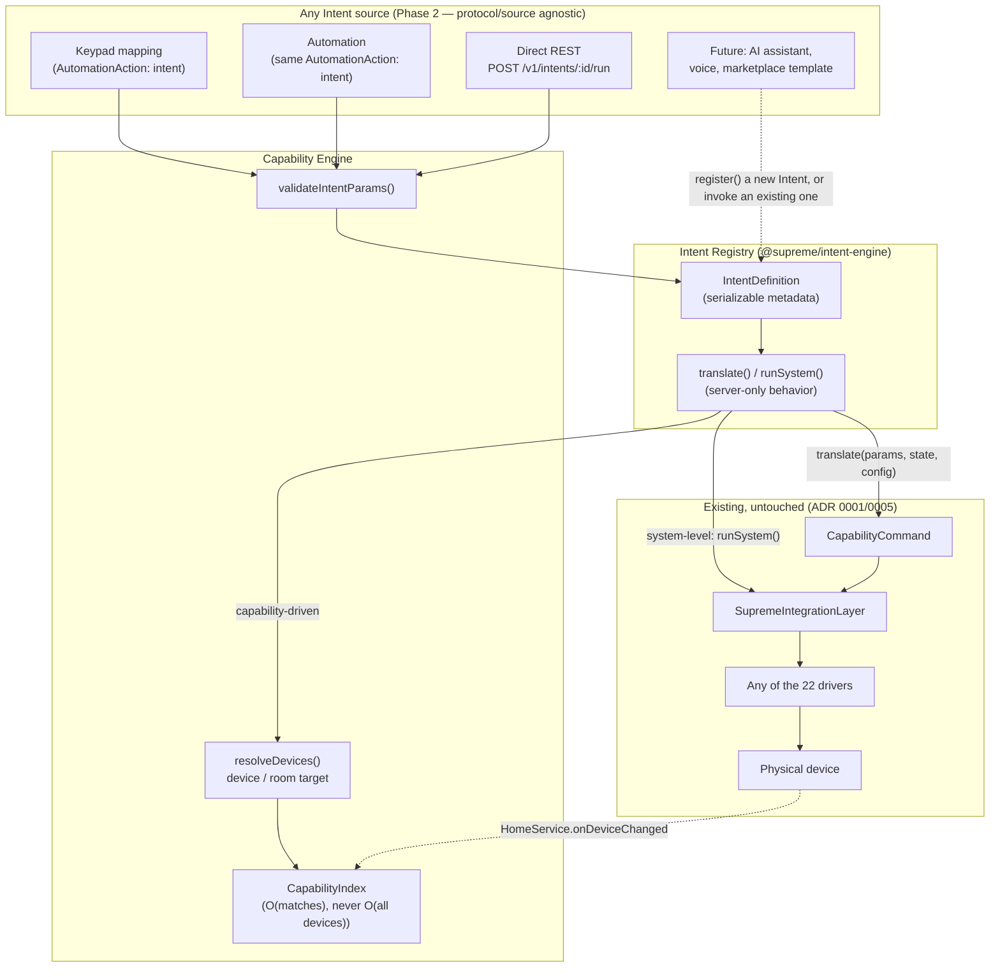
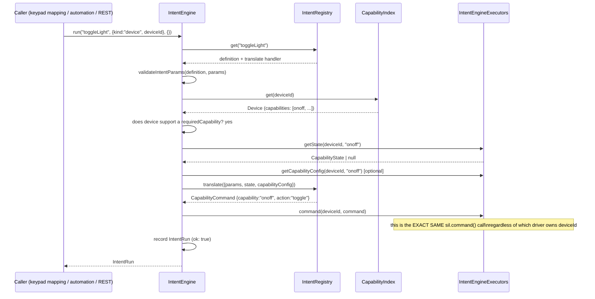
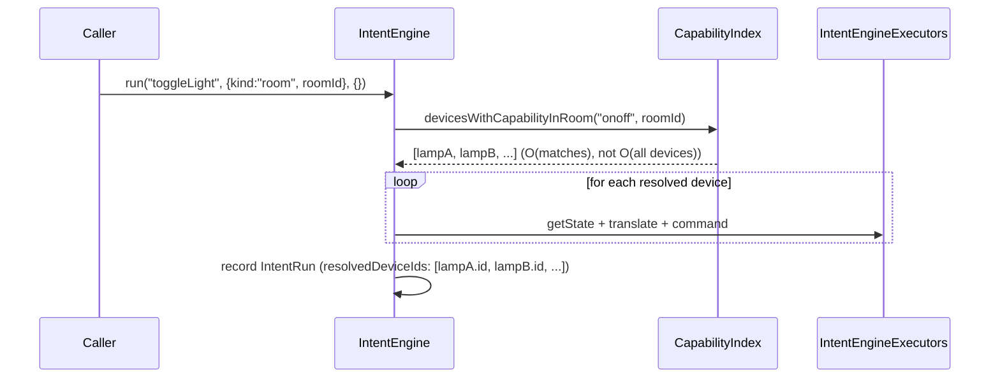

# Universal Intent & Capability Engine — Architecture Reference (Phase 2)

> Governed by **ADR 0017**, building on the Universal Keypad Framework (ADR 0016).
> This document: architecture diagram, service responsibilities, sequence
> diagrams, Intent lifecycle, capability resolution flow, Intent Registry
> specification, driver integration specification, migration strategy, performance
> and scalability analysis, public APIs, extension points, and future roadmap.

## 1. Why this exists

Phase 1 made keypad *input* protocol-independent. Phase 2 makes the *meaning* of
that input protocol- AND device-independent: a mapping says `ToggleLight`, not
"write `onoff.toggle` to device `dev_01ABC...`" — the Capability Engine resolves
which device(s), and which concrete command, satisfy that meaning, every time it
runs, never once at authoring time. Replace the KNX dimmer behind that mapping with
Casambi, Matter, DALI, Zigbee, or MQTT tomorrow: nothing about the mapping changes.

## 2. Architecture diagram



## 3. Service responsibilities

| Component | Package | Responsibility |
|---|---|---|
| `IntentDefinition`/`IntentTarget` | `@supreme/domain-model` | Pure, serializable schema — safe for a client, template, or AI to consume. |
| `AutomationAction`'s `"intent"` variant | `@supreme/domain-model` | The one new action type reused by both the Automation Engine and the Keypad Mapping Engine. |
| `IntentRegistry` | `@supreme/intent-engine` | The extensible-forever catalog: definition + `translate`/`runSystem` handler, paired and validated at registration. |
| `CapabilityIndex` | `@supreme/intent-engine` | O(matches) capability→device(s) lookup, kept in sync via `HomeService.onDeviceChanged`. |
| `registerBuiltinIntents` | `@supreme/intent-engine` | The 42-intent built-in catalog across 6 categories. |
| `validateIntentParams` | `@supreme/intent-engine` | Real, typed parameter validation + defaults. |
| `IntentEngine` | `@supreme/intent-engine` | The Capability Engine's executor: resolve target → validate params → translate/dispatch → record run trace. |
| `AutomationExecutors.runIntent` | `@supreme/automations` | The seam both the Automation Engine and Keypad Mapping Engine call into the Intent Engine through. |
| Gateway context (`context.ts`) | `@supreme/gateway` | Composition root: builds the `CapabilityIndex`/`IntentRegistry`/`IntentEngine`, wires `runIntent` into the shared executors. |
| Gateway routes (`routes/intents.ts`) | `@supreme/gateway` | Public API: list/get definitions, run directly, read run history. |

## 4. Sequence diagrams

### 4.1 Intent lifecycle (registration → invocation → execution)

```mermaid
sequenceDiagram
    participant Boot as Gateway boot (initWithHome)
    participant Reg as IntentRegistry
    participant Idx as CapabilityIndex
    participant Home as HomeService
    participant Eng as IntentEngine

    Boot->>Reg: registerBuiltinIntents(registry)
    Note over Reg: 42 intents registered; register() validates\ntranslate/runSystem pairing immediately
    Boot->>Idx: hydrate(await home.listDevices())
    Boot->>Home: onDeviceChanged(listener)
    Note over Boot,Idx: listener calls idx.upsert()/idx.remove() —\nnever a re-scan of every device
    Boot->>Eng: new IntentEngine({ registry, capabilityIndex, executors })

    Note over Eng: engine is now live for any caller —\nkeypad mapping, automation, direct REST
```

### 4.2 Capability resolution flow (device target)



### 4.3 Capability resolution flow (room target — "Movie Mode")



### 4.4 Migration readiness — the same mapping survives a driver swap

```mermaid
sequenceDiagram
    participant Mapping as KeypadMapping (unchanged)
    participant Eng as IntentEngine
    participant SIL as SupremeIntegrationLayer

    Note over Mapping: Today — action: {type:"intent", intentId:"toggleLight", target:{kind:"device",deviceId:D}}
    Mapping->>Eng: run("toggleLight", {device: D}, {})
    Eng->>SIL: command(D, {onoff, toggle})
    Note over SIL: D is currently bound to the KNX driver

    Note over Mapping: Installer replaces D's hardware with Casambi.\nDevice id D is unchanged; only its driver binding changes.
    Mapping->>Eng: run("toggleLight", {device: D}, {}) — IDENTICAL call
    Eng->>SIL: command(D, {onoff, toggle}) — IDENTICAL call
    Note over SIL: D is now bound to the Casambi driver — the\nIntent Engine never knew, never needed to know
```

## 5. Intent Registry specification

`IntentDefinition` (`packages/domain-model/src/intents.ts`):

```ts
{
  id: string;                  // camelCase, stable forever once shipped
  name: string;
  category: "lighting" | "climate" | "av" | "blinds" | "security" | "system";
  description: string;
  requiredCapabilities: CapabilityKind[];  // empty ⇒ system-level intent
  parameters: IntentParameterSpec[];
  targetKinds: ("device" | "room" | "scene" | "automation" | "home")[];
  version: string;              // semver
  i18nKey: string | null;       // future localization hook
}
```

`IntentParameterSpec`: `{ key, type: "number"|"boolean"|"string"|"enum", required,
min?, max?, options?, default?, description }` — validated by
`validateIntentParams` before every dispatch.

**Registration** (`IntentRegistry.register(definition, { translate?, runSystem? })`):
exactly one of `translate`/`runSystem` is required, matching whether
`requiredCapabilities` is non-empty — enforced immediately, not at first
invocation. `register()` is public API: any future module (a driver, a marketplace
template importer, an AI module) can add a new Intent with zero changes to this
registry's own code or to `IntentEngine`.

**The built-in catalog** (`registerBuiltinIntents`, 42 intents):

| Category | Intents |
|---|---|
| Lighting | `toggleLight`, `lightOn`, `lightOff`, `increaseBrightness`, `decreaseBrightness`, `setBrightness`, `increaseCCT`, `decreaseCCT`, `setColor`, `activateScene` |
| Climate | `increaseTemperature`, `decreaseTemperature`, `setTemperature`, `fanSpeedUp`, `fanSpeedDown`, `hvacMode`, `toggleHVAC`, `swingMode`* |
| AV | `powerToggle`, `volumeUp`, `volumeDown`, `mute`, `playPause`, `stop`, `nextTrack`, `previousTrack`, `inputNext`, `inputPrevious` |
| Blinds | `open`, `close`, `stopCover`†, `tiltUp`*, `tiltDown`* |
| Security | `lock`, `unlock`, `arm`, `disarm`, `panic` |
| System | `runAutomation`, `runScene`, `executeScript`*, `notification`, `webhook`* |

\* Registered, but execution honestly throws — no swing/tilt field exists in the
capability model yet, no script engine or webhook dispatcher exists yet.
† Named `stopCover`, not `stop`, to avoid colliding with AV's `stop` (transport
stop) — both are valid, distinct intent ids in one flat namespace.

## 6. Capability Resolution flow (detail)

1. **Validate the target kind** is one the intent accepts (`targetKinds`).
2. **Validate params** against `IntentParameterSpec[]` (required/type/bounds),
   filling declared defaults.
3. **Branch on `requiredCapabilities`**:
   - **Empty → system-level.** No device resolution at all; `runSystem` is called
     directly against the target (scene/automation/home).
   - **Non-empty → capability-driven.** Resolve device(s) via `CapabilityIndex`:
     - `device` target: the named device, IF it exposes one of
       `requiredCapabilities` — else a clear `backend_unavailable` error (never a
       silent no-op).
     - `room` target: every device in that room exposing one of
       `requiredCapabilities` — the union, deduplicated.
4. **Per resolved device**: read current state (+ capability config, if the
   translator needs it), call `translate()`, dispatch via `executors.command()`.
5. **Record a run trace** (`IntentRun`) — always, success or failure — mirroring
   `AutomationRun`/`KeypadMappingRun`'s exact shape for observability parity.

## 7. Driver integration specification

**No driver-side change is required for Phase 2.** The Intent Engine sits entirely
above the SIL/driver seam — it only ever calls `executors.command(deviceId,
CapabilityCommand)`, the exact same call every existing route/automation/scene
already makes. A driver that implements `INativeProtocolDriver` correctly today
(any of the 22 in the fleet, or a future one built per
`Keypad-Driver-Author-Guide.md`) is automatically a valid Intent target the moment
its devices are commissioned with the right capabilities — nothing to opt into,
nothing to implement.

## 8. Migration strategy

Because `IntentEngine` only ever touches `Device`/`CapabilityKind`/
`CapabilityState`/`CapabilityCommand` — never a `ProtocolKind`, driver instance, or
manifest — device migration (KNX → Casambi → Matter → …) is invisible to it by
construction, not by convention. `engine.test.ts`'s "migration readiness" test
demonstrates this directly: the identical `run()` call against two different
`executors.command` implementations (standing in for two different drivers)
produces identical behavior. The **mapping** (keypad or automation) never changes;
only which driver `SupremeNativeAdapter.bind()` currently has bound to that device
id changes — a fact the SIL already owns and the Intent Engine never inspects.

## 9. Performance & scalability analysis

- **Capability lookup**: O(1) map lookup + O(matching devices) iteration —
  `CapabilityIndex.devicesWithCapability`/`devicesWithCapabilityInRoom`. Two
  thousand devices with ten supporting a given capability costs the same as two
  devices, ten of them.
- **Index maintenance**: O(1) amortized per device change (`upsert`/`remove`),
  driven by `HomeService.onDeviceChanged` — never a full re-hydration except at
  boot.
- **Intent lookup**: O(1) `Map` lookup in `IntentRegistry`, regardless of catalog
  size (42 today, or 4,200 from a future marketplace).
- **Parameter validation**: O(declared parameters for that intent), never O(every
  intent).
- **Room-target dispatch**: O(resolved devices) — the room could be a media room
  with 2 devices or a great room with 40; cost scales with what's actually there,
  never with the whole home's device count.
- **Thread safety**: identical reasoning to ADR 0016 — Node's single-threaded event
  loop, no `await` between reading and mutating `CapabilityIndex`'s maps within one
  synchronous call, `IntentEngine.run()` records its own trace regardless of
  concurrent calls for different intents/targets (no shared mutable state between
  them beyond the read-only index).

## 10. Public APIs

| Method | Path | Purpose |
|---|---|---|
| GET | `/v1/intents` | List the full Intent Registry catalog. |
| GET | `/v1/intents/:id` | One intent's definition. |
| POST | `/v1/intents/:id/run` | Invoke an intent against a target (body: `{ target, params? }`). |
| GET | `/v1/intents/runs` | Recent run traces (all intents). |
| GET | `/v1/intents/:id/runs` | Recent run traces (one intent). |

Gated by the `"intent"` `ResourceType` (view the catalog/history, control to
invoke), baseline permissions mirroring `"keypad_mapping"`'s per-role defaults.

`@supreme/intent-engine`'s barrel additionally exports `CapabilityIndex`,
`IntentRegistry`, `registerBuiltinIntents`, `validateIntentParams`, `IntentEngine`,
and every associated type — the same "reusable outside the gateway" posture
`@supreme/automations`/`@supreme/keypad-framework` already have.

## 11. Extension points

- **A new Intent**: call `IntentRegistry.register(definition, handlers)` — no core
  file needs to change. A future driver package, a marketplace template importer,
  or an AI module can do this at runtime.
- **A new target kind**: extend `IntentTargetKind`/`IntentTarget` in
  `intents.ts` (additive), then teach `IntentEngine.resolveDevices()` (or a new
  `runSystem`-only path) to handle it — the pattern already established for
  `device`/`room` vs. `scene`/`automation`/`home`.
- **A new driver**: nothing to do for Intent support specifically — follow
  `Keypad-Driver-Author-Guide.md`/`Driver-SDK.md` as normal; the Intent Engine
  picks up its devices automatically via the Capability Index.
- **Filling an honest gap**: when `TemperatureState`/`PositionState` eventually
  gain swing/tilt fields (a genuine capability-model change, done deliberately, not
  speculatively), `swingMode`/`tiltUp`/`tiltDown`'s `translate` handlers get a real
  implementation — the catalog entries don't move.

## 12. Future roadmap

- **Universal Keypad Editor / Intent mapping UI** — a visual editor for
  input→intent→target mappings, explicitly out of scope for both Phase 1 and
  Phase 2 (backend-only, per both briefs).
- **AI-generated mappings** — `IntentDefinition`'s metadata (name, description,
  category, parameters) is deliberately AI-consumable; a future assistant could
  propose "Movie Mode" mappings from a natural-language request without any
  protocol knowledge, exactly as the brief's worked example describes.
- **Scene/template marketplace** — `IntentDefinition`/`IntentTarget`/
  `KeypadMapping` are all plain JSON; a Luxury Villa/Apartment/Hotel/Office/
  Developer template is just a bundle of these records, portable across any home
  regardless of installed hardware brand.
- **Real driver work** — filling the `swingMode`/`tiltUp`/`tiltDown` capability gap
  (a `TemperatureState`/`PositionState` schema addition) and building the first
  real keypad driver (see `Keypad-Driver-Author-Guide.md`) are the natural next
  steps toward a fully live end-to-end deployment.
