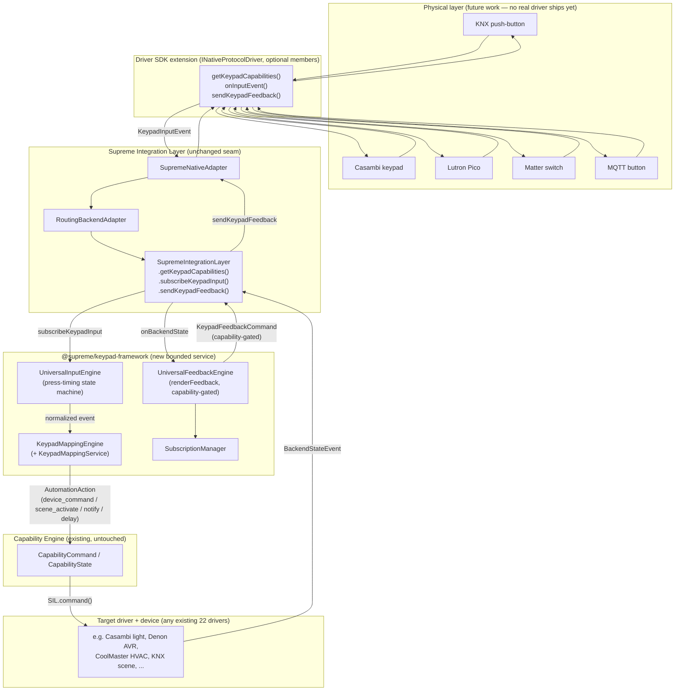
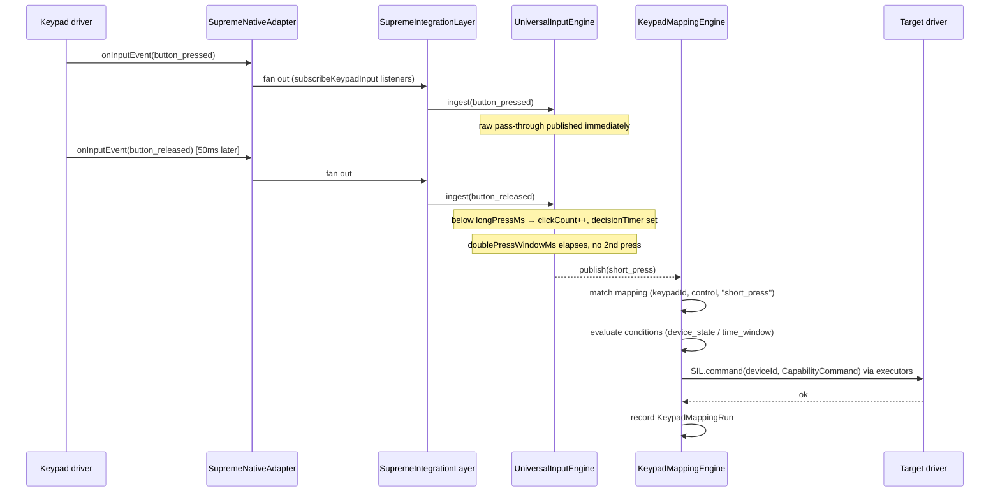
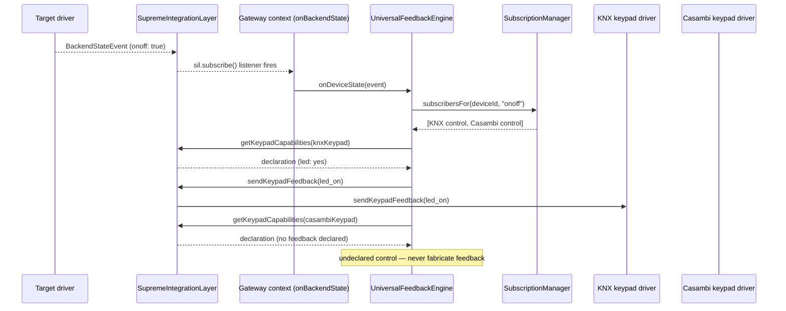
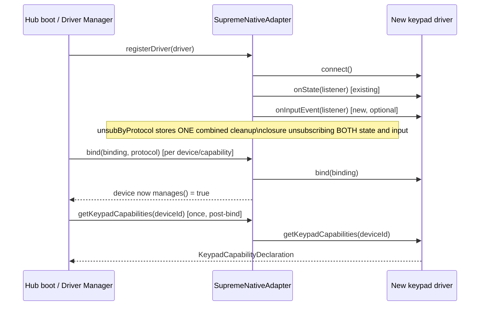

# Universal Keypad Framework — Architecture Reference (Phase 1)

> Governed by **ADR 0016**. This document is the detailed reference: architecture
> diagram, service responsibilities, sequence diagrams, Driver SDK additions, public
> interfaces, registration flow, lifecycle, thread safety, scalability, performance,
> migration strategy, testing strategy, and the no-breaking-changes guarantee. For
> "how do I write a keypad driver," see `Keypad-Driver-Author-Guide.md`.

## 1. Why this exists

SupremeOS already refuses to hardcode a device's protocol into the UI or the
Automation Engine — a KNX dimmer and a Casambi dimmer are both just `brightness`.
This framework applies the identical rule to **input**: a KNX push-button, a
Casambi keypad, a Lutron Pico, a Matter switch, an MQTT button, an RTI keypad, a
Zigbee remote, a BLE fob, or a DALI push-button input unit must be able to control
*any* Supreme device, through *one* pipeline, with *zero* protocol-to-protocol
special cases.

## 2. Architecture diagram



Two independent flows share the same seam:

- **Input flow** (top → bottom, left path): `Physical Input → Universal Input Event
  → Mapping Engine → Capability Engine → Target Driver → Target Device`.
- **Feedback flow** (bottom → top, right path): `Device State Change → State Engine
  (the SIL) → Universal Feedback Engine → All Compatible Keypads`.

Nowhere in this diagram does one protocol's driver call another protocol's driver.

## 3. Service responsibilities

| Component | Package | Responsibility |
|---|---|---|
| `INativeProtocolDriver` (3 new optional members) | `@supreme/integration-layer` | The ONE place a real protocol's keypad wire format is translated to/from the generic types below. |
| `SupremeNativeAdapter` / `RoutingBackendAdapter` / `SupremeIntegrationLayer` | `@supreme/integration-layer` | Pass-through plumbing — identical shape to the existing `getDiagnostics`/`getCapabilityConfig` seam. Never branch on protocol. |
| `UniversalInputEngine` | `@supreme/keypad-framework` | Normalizes raw driver input into `KeypadInputEvent`; derives short/long/double/triple-press and hold-start/holding/hold-end from raw press/release pairs via one shared timing state machine. |
| `SubscriptionManager` | `@supreme/keypad-framework` | Indexes `deviceId+capability → subscribed keypad controls` for O(subscribers) feedback fan-out. |
| `UniversalFeedbackEngine` | `@supreme/keypad-framework` | Fans a device's state change out to every subscribed keypad control, rendering only feedback types that control's real declaration supports. |
| `KeypadMappingEngine` / `KeypadMappingService` | `@supreme/keypad-framework` | The Mapping Engine: matches `(keypadId, control, event)` to a mapping, evaluates conditions, runs the (variable-expanded, already-concrete) actions, records a run trace. |
| `expandVariables` | `@supreme/keypad-framework` | Optional Variables: one-time `"{{name}}"` substitution at mapping create/update, before zod validation. |
| Gateway context (`context.ts`) | `@supreme/gateway` | Composition root: wires the engines to the SIL and to the *same* executors the Automation Engine uses. |
| Gateway routes (`routes/keypad.ts`) | `@supreme/gateway` | The Mapping Engine Interface's backend API (CRUD, no visual editor). |

## 4. Sequence diagrams

### 4.1 Input → action (a keypad press drives a device)



### 4.2 Feedback (a device's state change reaches every subscribed keypad)



### 4.3 Registration (a driver comes online)



## 5. Driver SDK additions

Added to `services/integration-layer/src/protocols/driver.ts`'s
`INativeProtocolDriver` — **all three optional**, exactly like the fleet's existing
`getArtwork?`/`getCapabilityConfig?`/`getDiagnostics?`:

```ts
getKeypadCapabilities?(deviceId: DeviceId): KeypadCapabilityDeclaration | null;
onInputEvent?(listener: (event: KeypadInputEvent) => void): () => void;
sendKeypadFeedback?(command: KeypadFeedbackCommand): Promise<void>;
```

Mirrored on `IBackendAdapter` (`adapter.ts`) with the same optionality. A driver
implements:

- **None of them** → completely unaffected (the common case today: all 22 shipped
  drivers).
- **All three** → a full input+feedback keypad (e.g. a future KNX push-button
  driver with LED feedback).
- **`onInputEvent` only** → an input-only keypad (a bare contact closure with no
  onboard LED/display — the common case for many wired KNX/DALI push-buttons).

See `Keypad-Driver-Author-Guide.md` for the step-by-step guide.

## 6. Public interfaces

`@supreme/keypad-framework`'s barrel (`index.ts`) exports:

- `UniversalInputEngine` (+ `UniversalInputEngineOptions`)
- `UniversalFeedbackEngine`, `renderFeedback` (+ `UniversalFeedbackEngineOptions`, `DeviceStateEvent`)
- `SubscriptionManager`, `InMemoryKeypadSubscriptionStore` (+ `IKeypadSubscriptionStore`, `CreateKeypadSubscriptionInput`)
- `KeypadMappingEngine` (+ `KeypadMappingEngineOptions`, `KeypadMappingRun`, `KeypadMappingRunAction`)
- `KeypadMappingService` (+ `CreateKeypadMappingInput`, `UpdateKeypadMappingInput`)
- `InMemoryKeypadMappingStore` (+ `IKeypadMappingStore`)
- `expandVariables`

`packages/domain-model` additionally exports: `KeypadInputCapability`,
`KeypadFeedbackCapability`, `KeypadControlKind`, `KeypadControlDescriptor`,
`KeypadCapabilityDeclaration`, `KeypadInputEvent`, `KeypadInputEventType`,
`KeypadFeedbackCommand`, `KeypadFeedbackType`, `KeypadSubscription`,
`KeypadMapping`, `KeypadMappingInput`, `KeypadMappingId`, `KeypadSubscriptionId`,
`evaluateComparator`, `readCapabilityField`, `isWithinScheduleWindow`.

`@supreme/contracts` additionally exports (`keypad.ts`): `CreateKeypadMappingRequest`,
`UpdateKeypadMappingRequest`, `KeypadMappingResponse`, `KeypadMappingList`,
`SetKeypadMappingEnabledRequest`, `KeypadMappingRun`, `KeypadMappingRunList`,
`CreateKeypadSubscriptionRequest`, `KeypadSubscriptionResponse`,
`KeypadSubscriptionList`, `KeypadCapabilitiesResponse`.

### REST surface (backend API only, per the brief — no editor)

| Method | Path | Purpose |
|---|---|---|
| GET | `/v1/devices/:id/keypad-capabilities` | A device's real keypad capability declaration, or `null`. |
| GET | `/v1/keypad/mappings` | List mappings. |
| POST | `/v1/keypad/mappings` | Create (expands `variables`, validates). |
| PATCH | `/v1/keypad/mappings/:id` | Update. |
| POST | `/v1/keypad/mappings/:id/enabled` | Enable/disable. |
| POST | `/v1/keypad/mappings/:id/run` | Manual test-run (skips conditions). |
| GET | `/v1/keypad/mappings/runs` | Recent run traces (all mappings). |
| GET | `/v1/keypad/mappings/:id/runs` | Recent run traces (one mapping). |
| DELETE | `/v1/keypad/mappings/:id` | Remove. |
| GET | `/v1/keypad/subscriptions` | List feedback subscriptions. |
| POST | `/v1/keypad/subscriptions` | Subscribe a keypad control to a device+capability. |
| DELETE | `/v1/keypad/subscriptions/:id` | Unsubscribe. |

Every route is gated by the `"keypad_mapping"` `ResourceType` (view/create/
update/delete/control), with baseline role permissions mirroring `"automation"`'s.

## 7. Registration flow

1. A driver is installed/enabled (existing Driver Manager flow, unchanged) and
   registered via `SupremeNativeAdapter.registerDriver(driver)`.
2. `wireDriver()` calls `driver.connect()`, then wires `onState` (existing) AND
   `onInputEvent` (new, only if the driver implements it) into one combined
   cleanup closure stored in `unsubByProtocol`.
3. Commissioning binds a device/capability: `bind(binding, protocol)` — unchanged
   call, now also the point after which `getKeypadCapabilities(deviceId)` returns
   real data instead of `null` (mirrors when `getCapabilityConfig` starts returning
   real data today).
4. The gateway's `UniversalInputEngine`/`KeypadMappingEngine` start receiving
   events the instant `sil.subscribeKeypadInput(...)` is wired in
   `AppContext.initWithHome()` — no separate "enable the keypad framework" step;
   it's live for any bound keypad the moment the home exists, exactly like
   automations.
5. A homeowner/installer creates `KeypadMapping`s and `KeypadSubscription`s via the
   REST API above at any time — no ordering dependency on driver registration (a
   mapping referencing a not-yet-bound keypad is inert until that keypad exists,
   never an error).

## 8. Lifecycle

- **Driver lifecycle**: unchanged from ADR 0001/"Driver Lifecycle Completion" —
  `connect()`/`disconnect()`/`bind()`/`unbind()`. The new `onInputEvent`
  unsubscribe is folded into the SAME cleanup path `unregisterProtocol()` already
  calls, so a driver removal cleans up its keypad-input wiring with zero new
  teardown code.
- **Engine lifecycle**: `UniversalInputEngine` holds per-`(keypadId,control)` timers
  (`longPressTimer`/`holdTicker`/`decisionTimer`); `dispose()` clears every timer
  for tests/shutdown. In production the engine lives for the gateway process's
  lifetime (one instance per home, created in `initWithHome()`), so its per-control
  state map only grows with distinct controls actually pressed — bounded by the
  number of physical keypad controls in the home, not by event volume.
- **Mapping/Subscription lifecycle**: CRUD via the service layer; `reload()` keeps
  the in-memory engine's active mapping list in sync with the store on every write
  (mirrors `AutomationService`).

## 9. Thread safety

Node.js's single-threaded event loop is the same safety net every other engine in
this codebase relies on (`AutomationEngine`, `SupremeNativeAdapter`, …) — this
framework introduces no new concurrency primitive and needs none:

- `UniversalInputEngine`'s per-control `ControlState` map is only ever mutated
  synchronously inside `ingest()`/timer callbacks, both of which run on the event
  loop with no `await` in between reading and writing a given control's state — no
  interleaving is possible between two events for the SAME control.
- `SubscriptionManager`'s `byDevice` index is a plain `Map<string, Map<...>>`;
  reads (`subscribersFor`) and writes (`subscribe`/`unsubscribe`) are synchronous.
- `UniversalFeedbackEngine.onDeviceState` is `async` (it awaits
  `getKeypadCapabilities`/`sendFeedback`), but each subscriber's send is isolated
  in its own try/catch — a slow or failing driver never blocks or corrupts another
  subscriber's fan-out, and two concurrent `onDeviceState` calls for two DIFFERENT
  devices proceed independently (no shared mutable state between them beyond the
  read-only `SubscriptionManager` index).
- `KeypadMappingEngine.onInputEvent` iterates a snapshot array (`this.mappings`,
  replaced wholesale by `setMappings()` on every CRUD write, never mutated
  in-place) — a mapping edit mid-fan-out can't corrupt an in-flight iteration.

## 10. Scalability analysis

- **Input fan-out**: O(1) per raw event at the driver→engine boundary (`Set`-based
  listeners, same pattern as `onState`). Press-timing state is O(number of distinct
  `keypadId#control` pairs pressed at least once), not O(event volume) — a control
  that's never pressed again after its first event keeps exactly one small object
  in the map forever in the current implementation (no idle-eviction); for a
  realistic home (tens to low hundreds of physical controls) this is negligible
  memory, and matches automations' precedent (`lastFired` map has the same
  characteristic and has never needed eviction in production use).
- **Feedback fan-out**: O(subscribers for the specific device+capability that
  changed), via the `SubscriptionManager`'s device-keyed index — NOT O(all
  subscriptions on the hub). A capability declaration is cached once per keypad
  per fan-out (not re-fetched per subscribed control on the same keypad).
- **Mapping matching**: O(enabled mappings) per input event — a linear scan, same
  complexity as `AutomationEngine.onDeviceState`'s trigger scan. This is the
  established, tested pattern in this codebase (homes have dozens, not millions,
  of mappings) — a per-`(keypadId,control,event)` index would be a valid future
  optimization if a real deployment's mapping count ever made the linear scan
  measurable, but building it now would be premature for an as-yet-unpopulated
  Phase 1 feature.
- **Cross-process**: `subjects.keypadInput` follows the identical NATS/in-process
  bus pattern as `subjects.deviceState` — horizontal gateway scale-out requires
  zero additional work here; it inherits whatever `@supreme/messaging` backend is
  configured.

## 11. Performance considerations

- Press-timing derivation uses real (or test-injected) timers, not polling — zero
  CPU cost between events.
- `renderFeedback` is a pure function with no I/O; the only I/O per feedback
  fan-out is one `getKeypadCapabilities` call per distinct keypad (cached across
  that keypad's controls) and one `sendFeedback` call per actually-gated command —
  never a wasted driver round-trip for an undeclared feedback type.
- `expandVariables` is a single recursive JSON walk at mapping create/update time
  only — never on the hot input-event path (the stored mapping's actions are
  already concrete by execution time), so variable support has zero runtime cost.

## 12. Migration strategy

There is nothing to migrate FROM — this is new, additive surface. The migration
concern that matters here is forward: **future keypad drivers must be addable
without touching this framework.** That guarantee is structural, not aspirational:
`protocols/keypad-extensibility.test.ts` proves a from-scratch, synthetic driver
(never registered anywhere real) can implement the three optional members and flow
end-to-end through `SupremeNativeAdapter`/`SupremeIntegrationLayer` with ZERO
changes to this framework's code — the same proof pattern ADR 0015 established for
the AV SDK's extensibility.

## 13. Testing strategy

| Layer | File | What it proves |
|---|---|---|
| Domain-model | `condition-eval.test.ts` | Shared comparator/window logic is correct in isolation. |
| Input Engine | `keypad-framework/src/input-engine.test.ts` | Press-timing derivation (short/double/triple/hold/long-press), independent controls, no leaked timers, raw pass-through. |
| Feedback Engine | `keypad-framework/src/feedback-engine.test.ts` | Capability gating (never fabricated), multi-subscriber fan-out, per-subscriber failure isolation. |
| Subscription Manager | `keypad-framework/src/subscription-manager.test.ts` | The brief's exact worked example (one light, 3 keypad subscribers), hydrate-from-store. |
| Mapping Engine | `keypad-framework/src/mapping-engine.test.ts` | Matching semantics, condition gating, delay actions, run-trace recording, manual test-run. |
| Variables | `keypad-framework/src/variables.test.ts` | Deep JSON substitution, unresolved references left untouched. |
| Service | `keypad-framework/src/service.test.ts` | End-to-end variable expansion + validation at create/update; CRUD lifecycle. |
| Driver SDK extension | `integration-layer/src/protocols/keypad-extensibility.test.ts` | A synthetic driver's capability declaration/input/feedback flow through the SIL; optional members are truly optional. |
| Gateway e2e | `gateway/src/keypad.e2e.test.ts` | The full REST surface over a real (mock-backend) hub: create-with-variables, validation failure, manual run driving a REAL device via the SIL, enable/delete, subscribe/unsubscribe, auth enforcement. |
| Regression gate | full `pnpm build`/`typecheck`/`test` | Zero change to any pre-existing driver/route/test — 55/55 build, 95/95 typecheck, 95/95 test tasks, all pre-existing suites passing unmodified. |

## 14. No-breaking-changes guarantee

- Every schema change is additive (`ProtocolKind`-style: new fields/types, no field
  removed or retyped). `ResourceType` gained one new enum value; `RolePolicy` is
  `Partial`, so no existing role definition needed to change shape.
- Every `INativeProtocolDriver`/`IBackendAdapter` addition is an **optional**
  member — verified by the full existing driver fleet (22 drivers, 378
  `@supreme/protocols` tests) passing unmodified.
- `AutomationEngine`'s only change is an extract-of-existing-logic refactor
  (`compare`/`readField`/`inWindow` → shared `condition-eval.ts` functions;
  `runAction`/`describeAction` bodies → exported `runAutomationAction`/
  `describeAutomationAction`) — behavior-identical, proven by its own 7-test suite
  passing unmodified before and after.
- No existing route, contract type, or gateway composition-root field was removed
  or retyped — only new optional `AppDeps` fields and new class fields were added
  to `context.ts`.
- Full monorepo verification: `pnpm build` 55/55, `pnpm typecheck` 95/95, `pnpm test`
  95/95 tasks — all green, all pre-existing tests passing unmodified.
